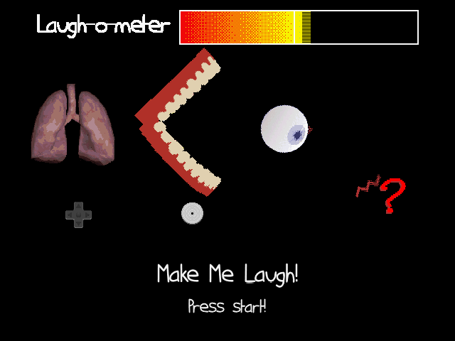
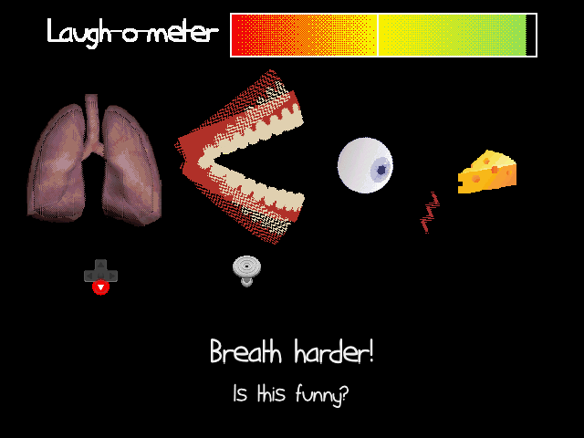
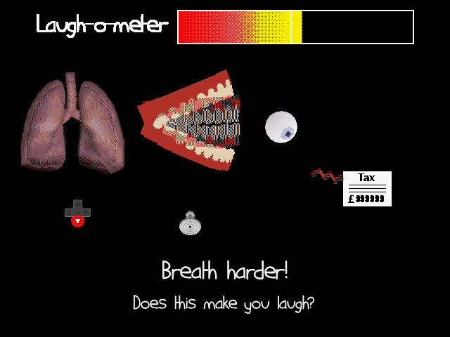

# Make Me Laugh 64!

A Global Game Jam 2024 on the theme of 'Make Me Laugh'. Can you make the machine laugh by pumping its lungs, flapping its mouth, and managing its attention?

## Controls

Start - Start a new game
D-Pad Up/Down - Pump the lungs
Analogue stick - Flap the mouth
C-Pad - Move the item

L - Debug mode (Can't die, and stops the music...)
  A - Next sub-level
  B - Insta-death

## Running

To run, use this ROM in either an emulator such as [Ares](https://ares-emu.net) or on actual hardware.

Best played with an actual N64 controller, but you can try with the above keys bound somewhere.

If there are any issues running it then give me a shout.

## Libraries used

- [Libdragon](https://github.com/DragonMinded/libdragon)
- [Chipmunk2D](https://github.com/slembcke/Chipmunk2D)

## More screenshots

